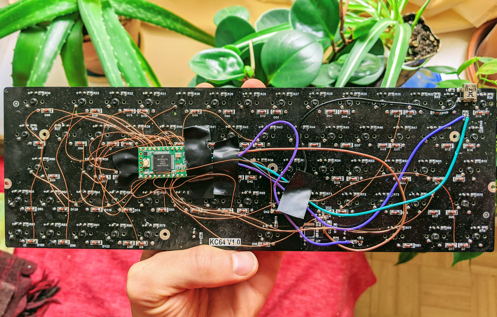

This project replaces the microcontroller in the dead-on-arrival [KC64](https://www.massdrop.com/buy/kc64-mechanical-keyboard/talk) keyboard with a Teensy 3.2.

Desolder the old microcontroller and with thin copper wire solder in the teensy using the following wiring.

Adapted from Xydane's [work](https://geekhack.org/index.php?topic=93537.0)

## wiring

Trace the KC64's MCU pins to a corresponding solder point on the keyboard matrix. Then solder that point to the teensy corresponding pin.

```
kc64_pin  teensy pin

(column pins)
15        1
16        0
22        2
21        3
18        4
19        5
20        6
17        7

(row pins)
32        8
34        10
35        9
36        11
37        12
38        14
39        15
40        16
41        17
42        18
43        19
44        20
45        21
46        22
```

## building + flashing

```
qmk compile -kb handwired/onekey/teensy_32 -km default
qmk flash -kb handwired/onekey/teensy_32 -km default
```




## to-do

I haven't figured out proper function key handling yet
